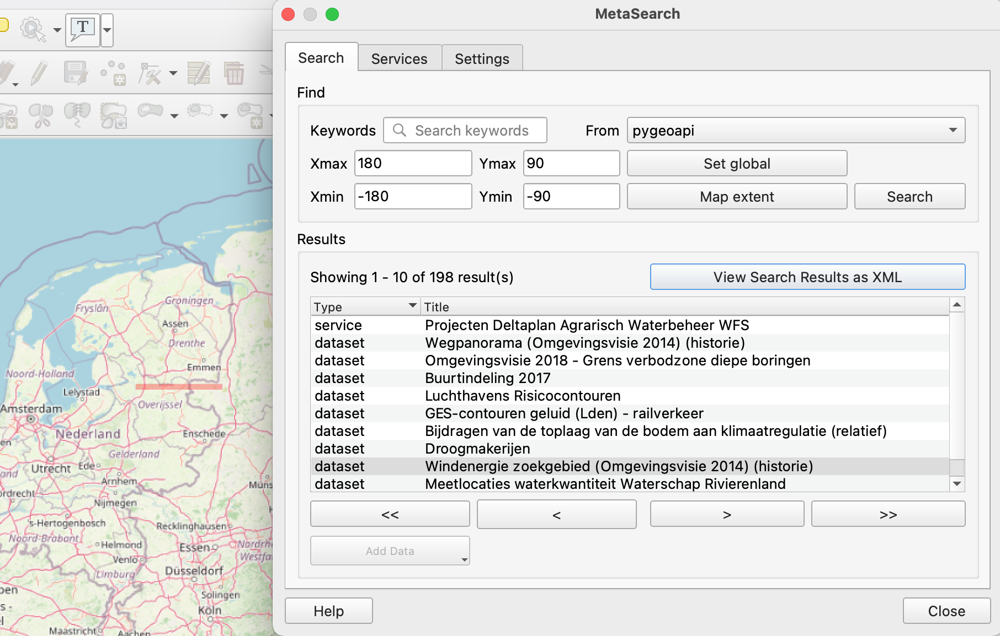

# Metadata

[OGC API - /Records](https://ogcapi.ogc.org/records/) provides access to repositories of metadata records. 
The API definition is likely to be adopted by OGC soon. pygeoapi contains an early implementation of the standard. 


## Publish a set of metadata records in pygeoapi

With pygeoapi we can setup OGC API - Records using any data provider. In this example we will use [TinyDB](https://tinydb.readthedocs.io/en/latest/index.html).

To use the example database *workshop/docker/data/records/catalogue.tinydb* we must configure it in `docker.config.yml` with following configuration:

``` {.yaml linenums="1"}
    example_catalog:
        type: collection
        title: FOSS4G Florence Record catalog
        description: FOSS4G Florence Record catalog (OGC API - Records)
        keywords:
            - Services
            - Infrastructures
            - Florence
            - FOSS4G
        links:
            - type: text/html
              rel: canonical
              title: information
              href: http://opendata.comune.firenze.it
              hreflang: en-US
        extents:
            spatial:
                bbox: [11.145, 43.718, 11.348, 43.84]
                crs: http://www.opengis.net/def/crs/OGC/1.3/CRS84
        providers:
            - type: record
              name: TinyDBCatalogue
              data: ../data/records/catalogue.tinydb
              id_field: externalId
              time_field: recordCreated
              title_field: title
```
Then restast the instance.

It's possible to load more example ISO19139 metadata in a TinyDB database with [this script](https://raw.githubusercontent.com/geopython/pygeoapi/master/tests/load_tinydb_records.py)

``` {.bash linenums="1"}
python3 load_tinydb_records.py /xml_folder/ /db_folder/sample-records.tinydb
```

## Client access

QGIS supports OGC API - Records via the [Metasearch plugin](https://docs.qgis.org/latest/en/docs/user_manual/plugins/core_plugins/plugins_metasearch.html). Metasearch originally focused on Catalogue Service for the Web (OGC:CSW) only, but has been extended to OGC API - Records last year. Metasearch is a default plugin in QGIS (no installation required).

!!! question "Query OGC API - Records from QGIS"

    Follow these steps to connect to a service and query datasets:

    - Locate the metasearch plugin in the web menu or on a toolbar (globe + binoculars). The main search panel opens with some popular catalogues pre-populated.

    { width=50% }

    - Open the `services` tab, to find the `new` button to create a new connection.
    - Add a connection to `https://demo.pygeoapi.io/master`.
    - Click `Serviceinfo` to get information about the service.
    - Return to the Search tab.
    - Select the connection you have just created.
    - type a search term and click `search`.
    - Notice that when you select a search result, a red box is drawn on the map highlighting the location of the dataset.

    { width=50% }

!!! note

    In optimal cases Metasearch will locate a file or service link on the metadata and enable the `add data` button (like it does for CSW). Unfortunately the OGC group is still discussing how to implement this in the standard. OGC API - Records is not final yet, so its functionality may be subject to change.
