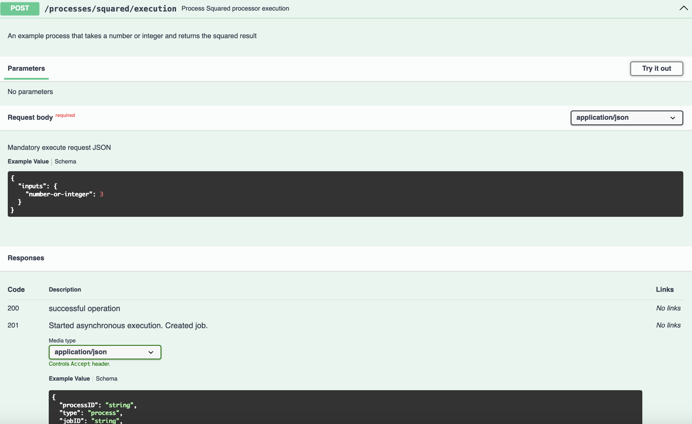
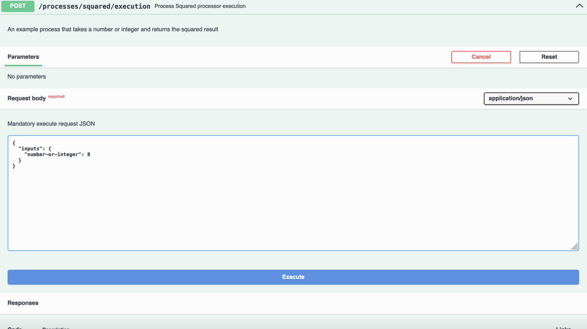
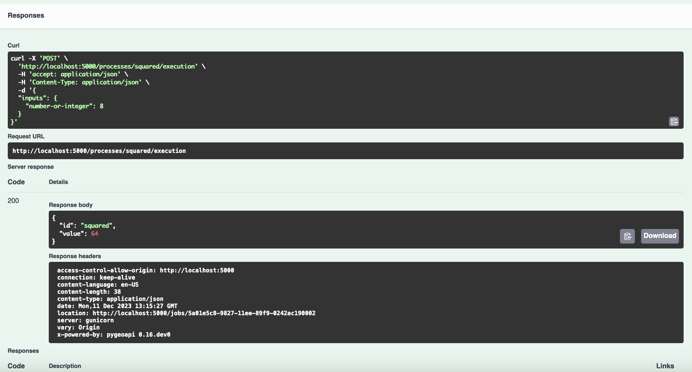

# Exercise 8 - Functions via OGC API - Processes

[OGC API - Processes](https://ogcapi.ogc.org/processes) supports the wrapping of computational tasks into
executable processes that can be offered by a server through a Web API and be invoked by a client application.

* [OGC API - Processes: Part 1: Core](https://docs.ogc.org/is/18-062r2/18-062r2.html)

OGC API - Processes uses OGC API - Common as a building block, thus enabling streamlined deployment and integration
for clients and users.

## pygeoapi support

pygeoapi supports the OGC API - Processes specification, with the ability to publish Python code (no matter how
simple or complex) as an OGC API Process definition.  pygeoapi also support synchronous or asynchronous processing,
with the ability to store and retrive the status/results of 'jobs'.

!!! note

    See [the official documentation](https://docs.pygeoapi.io/en/latest/data-publishing/ogcapi-processes.html) for more information
    on publishing processes in pygeoapi


## Publishing Python code as a process in pygeoapi

With pygeoapi we can setup OGC API - Processes using Python code that implements the pygeoapi `BaseProcessor`, which is a core pygeoapi
abstract base class.  In this exercise we will implemented a "squared" function as a process using the sample Python code in
`workshop/exercises/plugins/process/squared.py`.  The process is already defined to be part of the pygeoapi environment and configuration.

!!! question "Update the pygeoapi configuration"

    Open the pygeoapi configuration file in a text editor. Add a new process section as follows:

``` {.yaml linenums="1"}
    squared:
        type: process
        processor:
            name: pygeoapi.process.squared.SquaredProcessor
```

!!! question "Update Python code"

    Open the Python code at `workshop/exercises/plugins/process/squared.py`.  Find the `execute` function and update the Python
    code to calculate the input value squared.


Save the configuration and restart Docker Compose. Navigate to <http://localhost:5000/processes> to evaluate whether the new process has
been published.  Inspect the detailed process metadata by navigating to <http://localhost:5000/processes/squared> to inspect how the process
metadata defined in the Python code/file is made available in JSON..

## Client access

### Swagger

The easiest way to test the new process is by using pygeoapi's built in Swagger interface.  Navigate to <http://localhost:5000/openapi> and try out
the process in the Swagger UI.

{ width=120% }

{ width=120% }

{ width=120% }


# Summary

Congratulations!  You are now able to publish Python code as a process to pygeoapi.
